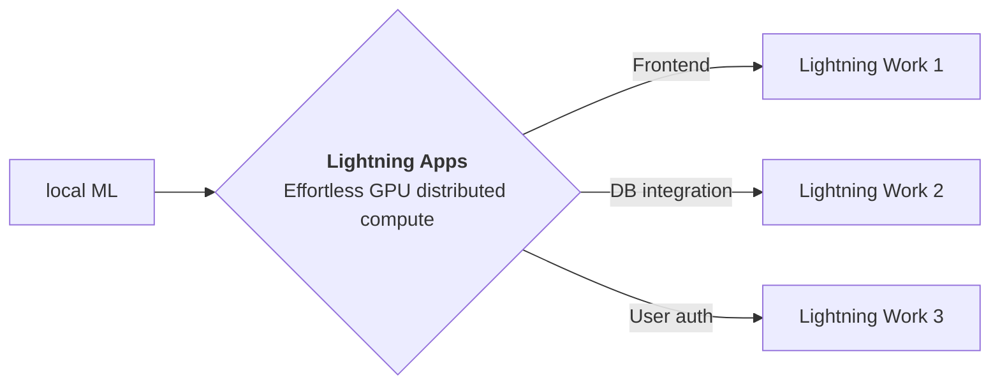

<div style="height: 90pt;"></div>
<div style="flex: 0 0 16%; margin-top: -10pt;">

</div>
<div style="flex: 0 0 65%; text-align: center;">
<h1 style="margin-bottom: 10pt;">Demo: AnimeGANv2</h1>
<h2>A demo of AnimeGANv2 research paper using Lightning App</h2>
</div>
<div style="flex: 1">
    <div style="display: flex; align-items: center;">
        
        <div style="font-size: 0.9rem; margin-right: 5pt;"><a href="https://github.com/pytorchlightning/">Lightning</a></div>
    </div>
    <div style="display: flex; align-items: center;">
        
        <div style="font-size: 0.9rem;"><a href="https://twitter.com/">@pytorchlightnin</a></div>
    </div>
</div>

--split--

# AnimeGANv2

## AnimeGAN combines neural style transfer and generative adversarial network (GAN) to accomplish this task

This app is a research poster demo of AnimeGANv2 paper. It showcasese the paper, blog, noteboo,k and model demo where
you can upload an image and convert it into Anime.
To create a research poster for your work
use the [Lightning Research Template app](https://github.com/PyTorchLightning/lightning-template-research-app).

Thanks to [Ahsen Khaliq](https://github.com/AK391) for his open source implementation of AnimeGANv2.


Source: tachibanayoshino

AnimeGANv2 propose an improved version of AnimeGAN. It prevents the generation of high-frequency artifacts by
simply changing the normalization of features in the network. In addition, it further reduce the scale of the
generator network to achieve more efficient animation style transfer. AnimeGANv2 trained on the newly established
high-quality dataset can generate animation images with better visual quality than AnimeGAN.

--split--

# Lightning Apps

## Lightning Apps can be built for any AI use case, including AI research, fault-tolerant production-ready pipelines, and everything in between.

!!! abstract "Key Features"

    - **Easy to use-** Lightning apps follow the Lightning philosophy- easy to read, modular, intuitive, pythonic and highly composable interface that allows you to focus on what's important for you, and automate the rest.
    - **Easy to scale**- Lightning provides a common experience locally and in the cloud. The Lightning.ai cloud platform abstracts the infrastructure, so you can run your apps at any scale. The modular and composable framework allows for simpler testing and debugging.
    - **Leverage the power of the community-** Lightning.ai offers a variety of apps for any use case you can use as is or build upon. By following the best MLOps practices provided through the apps and documentation you can deploy state-of-the-art ML applications in days, not months.



### Available at : `Lightning-AI/lightning-template-research-app/app.py`

```python
import lightning as L

poster_dir = "resources"
paper = "https://arxiv.org/pdf/2102.12593.pdf"
blog = "https://tachibanayoshino.github.io/AnimeGANv2/"
github = "https://github.com/TachibanaYoshino/AnimeGANv2"

app = L.LightningApp(
    ResearchApp(
        poster_dir=poster_dir,
        paper=paper,
        # github=github,
        blog=blog,
        notebook_path="resources/demo.ipynb",
        launch_gradio=True,
        launch_jupyter_lab=False,  # don't launch for public app, can expose to security vulnerability
    )
)
```

### Citation

```bibtex

@article{YourName,
  title={Your Title},
  author={Your team},
  journal={Location},
  year={Year}
}

```
